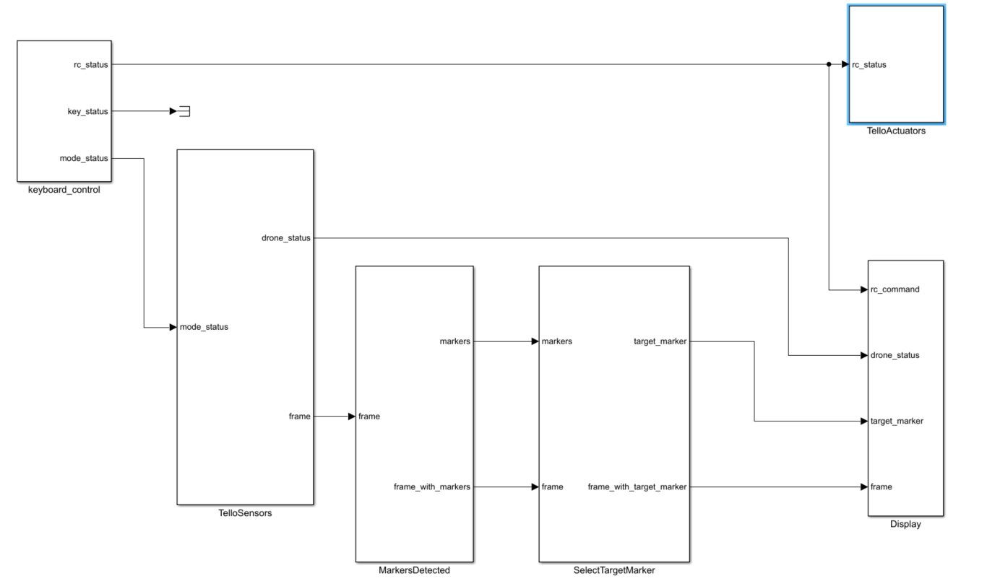
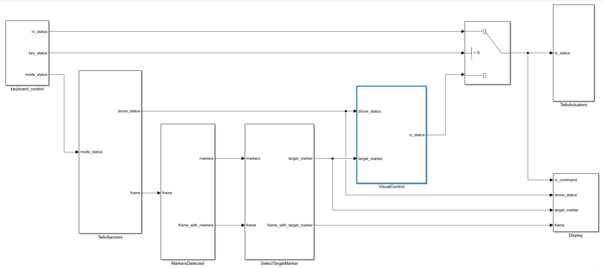

# Tello: Drone Racing Code
This program is based on the liberty [DJITelloPy](https://github.com/damiafuentes/DJITelloPy) and [pygame](https://www.pygame.org/).


we have organized the code by several subsystems (blocks) which communicate with each other. 

## Description of the ISAE Drone Challenge 2022


[Link to the challenge rules](https://websites.isae-supaero.fr/IMG/pdf/reglement_challenge_drone_2022-v2.pdf)

> The objective of the challenge will be to complete a drone race course completely autonomously (without the help of a pilot). The programming will be done in Python language. This course will be delimited by gates of several types (see photos below). Each gate will be marked with an ArUco marker (documentation of the ArUco library in [C++](https://docs.google.com/document/d/1QU9KoBtjSM2kF6ITOjQ76xqL7H0TEtXriJX5kwi9Kgc/edit) and [Python](https://mecaruco2.readthedocs.io/en/latest/notebooks_rst/Aruco/aruco_basics.html)). Each passage will be timed by the Chronodrone measurement system.
>
> A ranking of the teams by time of completion of the entire course will be established. The teams will know the circuit only on the day of the event, it will be up to them to make a code that can cover different types of course. However, there will be no gates higher than 5m and no turns higher than 90 degrees.

## Download Links
Can you dowload the UAV-Tello-Simulator from folowing link https://github.com/PYBrulin/UAV-Tello-Simulator

 
## Installation
Download "Drone Racing Code" folder
```
git clone https://github.com/F-KHENFRI/Tello-Drone-Racing-Code.git
```
Open a terminal on the "Drone Racing Code" folder and run the following commands:
```
pip install -r .\requirement.txt
git clone https://github.com/PYBrulin/DJITelloPy.git
cd DJITelloPy
pip install -e .
```
## Test aruco code
run the "main_test_aruco_code.py" (see the test_aruco_code.PNG image in the images folder) to get started with the aruco code. 
You don't need to run the simulator.


## Control the drone manually using a keyboard  
launch the "main_manual_drone_racing.py" (see image manual_drone_racing.PNG) to control the drone with the keyboard. 
You must run the simulator before running the code.


## Make an autonomous racing drone 
run the "autonomous_drone_racing.py" (see autonomous_drone_racing.PNG) to control the drone using the information obtained from marker aruco code. 
You must run the simulator before running the code. 
You can improve this code to make the drone faster in different scenarios.


## Authors

* **Fouad KHENFRI**

## License

This project is licensed under the MIT License - see the [LICENSE.txt](LICENSE.txt) file for details
