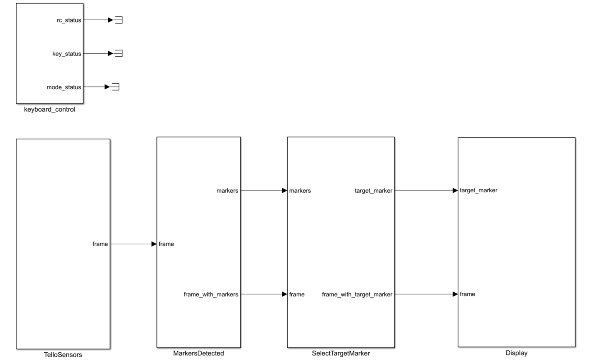

# Tello: Drone Racing Code
This program is based on the liberty [DJITelloPy](https://github.com/damiafuentes/DJITelloPy) and [pygame](https://www.pygame.org/).


we have organized the code by several subsystems (blocks) which communicate with each other. 

 
## Installation
Open a terminal on the "Drone Racing Code" folder and run the following commands:
```
pip install -r .\requirement.txt
git clone https://github.com/PYBrulin/DJITelloPy.git
cd DJITelloPy
pip install -e .
```
## Test aruco code
run the "main_test_aruco_code.py" (see the test_aruco_code.PNG image in the images folder) to get started with the aruco code. 
You don't need to run the simulator.



## Control the drone manually using a keyboard  
launch the "main_manual_drone_racing.py" (see image manual_drone_racing.PNG) to control the drone with the keyboard. 
You must run the simulator before running the code.


## Make an autonomous racing drone 
run the "autonomous_drone_racing.py" (see autonomous_drone_racing.PNG) to control the drone using the information obtained from marker aruco code. 
You must run the simulator before running the code. 
You can improve this code to make the drone faster in different scenarios.


## Authors

* **Fouad KHENFRI**

## License

This project is licensed under the MIT License - see the [LICENSE.txt](LICENSE.txt) file for details
